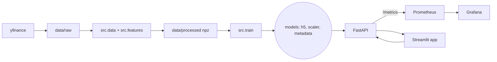

# fiap-techchalenge-f4

## Visão geral do projeto

Este repositório implementa uma solução **end‑to‑end** de previsão de preço de ações (ex.: **AMZN**) usando **redes LSTM** com dois horizontes de previsão: **H=1** (baseline) e **H=5** (solução principal). O objetivo é demonstrar todo o ciclo de um projeto de ML — **coleta de dados → engenharia de features → treino/avaliação → API em produção → observabilidade → frontend** — de forma reprodutível.

**O que foi feito (em alto nível):**
- **Ingestão de dados** com `yfinance` (OHLCV) e organização em `data/raw`.
- **Pré‑processamento e features**: criação de janelas temporais (window=60 por padrão), escalonamento e indicadores técnicos, gerando arrays em `data/processed`.
- **Treinamento** de dois modelos LSTM (H=1 e H=5) e salvamento de artefatos em `models/` (modelo(s), `scaler`, `metadata`).
- **Avaliação** com métricas (MAE/RMSE/MAPE) e gráficos de diagnóstico (predito vs real, resíduos e walk‑forward).
- **API FastAPI** para servir previsões e metadados, incluindo endpoints de *health/readiness* e uma rota de métricas `/metrics` para Prometheus.
- **Observabilidade local** via **Prometheus + Grafana** (Docker Compose) para acompanhar volume de requisições e latência.
- **Frontend Streamlit** que consome a API e permite testar previsões de forma interativa.

**Como validar rapidamente que está tudo funcionando:**
1) Execute o pipeline com `make` (ex.: `make install && make data && make features && make train`).
2) Suba a API (`make api`) e teste `GET /health` e `GET /ready`.
3) Abra o Streamlit (`make streamlit`) e faça chamadas de previsão.
4) (Opcional) Suba a stack de observabilidade (`make compose-up`) e veja os dashboards no Grafana.

A seção abaixo mostra a arquitetura e o fluxo de dados/serviços utilizados.

## Arquitetura (visão geral)

A figura abaixo resume o fluxo ponta‑a‑ponta do projeto.



## Estrutura do Projeto

```text
tech-challenge/
│
├── data/
│   ├── raw/                     # Dados brutos (yfinance)
│   └── processed/               # Dados após limpeza, splits e janelas
│
├── notebooks/
│   └── eda.ipynb                # EDA: estatísticas, sazonalidade, ACF/PACF
│
├── src/
│   ├── data.py                  # Ingestão, limpeza, split temporal (train/val/test)
│   ├── features.py              # Janelamento, escalonamento, indicadores técnicos
│   ├── model.py                 # Definição das LSTMs (H=1 e H=5) + callbacks
│   ├── train.py                 # Pipeline de treino e salvamento de artefatos
│   ├── evaluate.py              # Backtesting, métricas (MAE/RMSE/MAPE) e gráficos
│   └── utils/                   # Helpers (logging, paths, seed, config, validações)
│
├── api/
│   ├── main.py                  # FastAPI: /health, /predict, /metadata, /metrics
│   ├── inference.py             # Carrega artefatos e executa previsão (horizon=1|5)
│   ├── schemas.py               # Pydantic: validação dos payloads
│   └── monitoring.py            # Métricas Prometheus e middlewares de latência
│
├── models/
│   ├── model_h1.h5              # Modelo Keras para H=1 (baseline)
│   ├── model_h5.h5              # Modelo Keras para H=5 (multi-saída)
│   ├── scaler.joblib            # Escalonador salvo (fit no treino)
│   └── metadata.json            # Datas, métricas, hiperparâmetros, versões
│
├── monitoring/
│   ├── prometheus.yml           # Exemplo de scrape config (opcional)
│   └── dashboards/              # Dashboards (JSON) para observabilidade (opcional)
│
├── tests/
│   ├── test_features.py         # Shapes/índices e janelas dos .npz
│   ├── test_inference.py        # Artefatos H=1/H=5 e smoke de inferência
│   └── test_api.py              # Smoke dos endpoints (health, ready, metrics, predict)
│
├── docker/
│   ├── Dockerfile               # Imagem da API (python:3.11-slim + uvicorn)
│   └── docker-compose.yml       # API + Prometheus/Grafana (opcional)
│
├── scripts/
│   ├── fetch_data.py            # CLI: baixa dados (yfinance)
│   ├── preprocess.py            # CLI: processa e gera janelas
│   └── serve.sh                 # Sobe a API localmente
│
├── app.py                       # Streamlit consumindo a API
├── requirements.txt             # Dependências (pinned)
├── README.md                    # Guia completo (setup, execução, decisões)
├── .env.example                 # Ex.: WINDOW=60, H=5 etc.
├── .gitignore
└── .github/workflows/ci.yml     # CI: lint + testes
```

## Ambiente virtual e execução local

> Pré-requisitos: **Python 3.11+**, **pip**, **git**.

### 1) Criar e ativar o ambiente virtual

**macOS / Linux**
```bash
python3 -m venv .venv
source .venv/bin/activate
```

### 2) Instalar dependências
```bash
python -m pip install --upgrade pip
pip install -r requirements.txt
```

### 3) (Opcional) Configurar variáveis de ambiente
Crie o arquivo `.env` a partir do exemplo e ajuste valores conforme necessidade:
```bash
cp .env.example .env
# edite .env (ex.):
# WINDOW=60
# H=5
# TICKER=AMZN
# START_DATE=2018-01-01
```

### 4) Subir a API (via Makefile)

Com o ambiente ativo e dependências instaladas, use os alvos do Makefile:

```bash
make api       # modo padrão (logs JSON)
# ou, modo desenvolvimento com auto-reload:
make api-dev
```

Documentação: `http://127.0.0.1:8000/docs`

Teste rápido:
```bash
curl http://127.0.0.1:8000/health
```

### 5) Desativar o ambiente virtual
```bash
deactivate
```

> Dica: se preferir, crie um `Makefile` com alvos como `make venv`, `make install` e `make api` para simplificar os comandos (opcional).
> **Atualização:** este repositório **já inclui** um `Makefile`. Rode `make help` para ver todos os alvos disponíveis.

## Makefile (atalhos de execução)

O projeto traz um **Makefile na raiz** com alvos que encurtam a execução do fluxo completo.
> Dica: rode `make help` para listar e descrever todos os alvos.

### Ordem recomendada de execução (do zero)

1) **Instalar e preparar ambiente**  
```bash
make install
make env
```

2) **Baixar e preparar dados (yfinance → data/raw & data/processed)**  
```bash
make data
# variações:
# make data START=2019-01-01
# make data NO_WINSORIZE=1
```

3) **Gerar janelas/arrays (features) para treino**  
```bash
make features        # gera H=1 e H=5 (WINDOW=60 por padrão)
# ou apenas um dos horizontes:
# make features-h1
# make features-h5
```

4) **Treinar modelos (H=1 e H=5) e salvar artefatos em `models/`**  
```bash
make train           # ajustável: make train EPOCHS=80 BATCH=256 WINDOW=60
```

5) **(Recomendado) Avaliar e gerar plots**  
```bash
make eval-h1
make eval-h5
```

6) **Subir a API**  
```bash
make api             # modo padrão (logs JSON)
# ou, para desenvolvimento (auto-reload e logs verbosos):
make api-dev
```

7) **Smoke tests / Readiness**  
```bash
make smoke           # GET /health e /features-order
make ready           # GET /ready
```

> Dica: você pode encadear etapas numa linha:
> ```bash
> make data && make features && make train && make api
> ```

### Setup rápido
```bash
make install   # cria/usa .venv e instala requirements
make env       # cria .env a partir de .env.example, se não existir
```

### Pipeline de dados e treino
```bash
make data                      # baixa/prepara dados (yfinance)
make features                  # gera npz para H=1 e H=5 (window=60 por padrão)
make train                     # treina H=1 e H=5 e salva artefatos em models/
make eval-h1                   # avaliação do modelo H=1 (plots e métricas)
make eval-h5                   # avaliação do modelo H=5 (plots e métricas)
```

### API e Frontend
```bash
make api                       # sobe a API (Uvicorn) com logs em JSON (LOG_JSON=true)
make api-dev                   # API em modo dev (--reload) e logs texto (LOG_JSON=false)
make smoke                     # smoke tests: /health e /features-order
make ready                     # readiness: verifica se modelos/scaler existem
make streamlit                 # frontend Streamlit consumindo a API
```

> **Observação (Streamlit):** garanta que a API esteja rodando antes de abrir o frontend.
> Por padrão o `app.py` usa `API_BASE_URL=http://127.0.0.1:8000`. Para apontar para outra URL:
> ```bash
> make streamlit API_BASE_URL=http://127.0.0.1:8000
> ```
> Se a página abrir “em branco”, clique em **Rerun** no topo do Streamlit. Os logs detalhados aparecem no terminal.

### Qualidade, testes e limpeza
```bash
make lint                      # ruff check (se instalado)
make format                    # ruff format (se instalado)
make test                      # pytest (se instalado)
make clean                     # remove npz, modelos, scaler, metadata, plots
```

### Testes automatizados e CI
- Suite Pytest cobre features (.npz), artefatos de inferência (H=1/H=5) e smoke da API. Testes pesados fazem `skip` se artefatos faltarem ou se `CI=true`.
- Rode localmente com `pytest` (ou `make test`), ou apenas um arquivo: `pytest tests/test_api.py`.
- CI via GitHub Actions (`.github/workflows/ci.yml`): roda Ruff (`ruff check .`), Pytest filtrando marcações (`-m "not slow and not integration"`) e um smoke `/health` sob Uvicorn.

### Docker / Compose
```bash
make docker-build              # build da imagem da API (docker/Dockerfile)
make docker-run                # executa a imagem mapeando a porta 8000
make compose-up                # (opcional) API + Prometheus/Grafana
make compose-down              # derruba o compose
```

> Variáveis úteis: `WINDOW`, `EPOCHS`, `BATCH`, `API_PORT`, `API_BASE_URL`. Ex.: `make train EPOCHS=80` ou `make api API_PORT=9000`.

## Treinamento (LSTM H=1 e H=5)

A sequência abaixo treina os dois modelos exigidos (baseline H=1 e solução principal H=5) de forma reprodutível.

> Pré-requisitos: ambiente virtual ativo e dependências instaladas; diretórios de dados criados pelo passo de ingestão.

1) **Ingestão/Pré-processamento (se ainda não fez):**
```bash
python -m src.data --ticker AMZN --start 2018-01-01
```

2) **Geração de janelas/arrays (.npz):**
```bash
# baseline H=1
python -m src.features --ticker AMZN --window 60 --horizon 1
# solução principal H=5 (multi-saída)
python -m src.features --ticker AMZN --window 60 --horizon 5
```

3) **Treino dos modelos (H=1 e H=5):**
```bash
# Observação: instale TensorFlow conforme seu ambiente, se ainda não o fez.
# Intel/Linux/Windows
pip install "tensorflow>=2.15,<3"
# Apple Silicon (opcional)
# pip install tensorflow-macos tensorflow-metal

# Treinar ambos (H=1 e H=5)
python -m src.train --horizon both --window 60 --epochs 50 --batch_size 128
```

**Saídas esperadas:**
- `models/model_h1.h5` e `models/model_h5.h5` (pesos dos modelos)
- `models/metadata.json` (métricas, hiperparâmetros, versões)
- `models/scaler.joblib` (gerado no `features.py`)

---

## Avaliação (métricas, resíduos e backtesting)

Rode a avaliação para cada horizonte desejado. As métricas são calculadas na **escala original** do preço (Close), há comparação com o baseline ingênuo (persistência) e são gerados gráficos de diagnóstico.

```bash
# Avaliar H=1
python -m src.evaluate --horizon 1 --window 60

# Avaliar H=5
python -m src.evaluate --horizon 5 --window 60

# (opcionais) desabilitar gráficos de resíduos e/ou backtesting simples
python -m src.evaluate --horizon 5 --window 60 --no-residuals --no-walkforward
```

**Saídas esperadas:**
- Relatório: `models/evaluation_report_AMZN_w60_h{H}.json`
- Gráficos em `models/plots/`:
  - `pred_vs_true_AMZN_w60_h{H}.png`
  - `residuals_time_AMZN_w60_h{H}.png`
  - `residuals_hist_AMZN_w60_h{H}.png`
  - `walkforward_mae_t1_AMZN_w60_h{H}.png`

---

## O que cada gráfico mostra

**1) `pred_vs_true_*.png`** — *Série real vs. prevista*  
Para H=1 plota a série completa; para H=5 mostra o passo **t+1**. Ajuda a ver alinhamento, atrasos e períodos de maior erro.

**2) `residuals_time_*.png`** — *Resíduos no tempo*  
Resíduo = `y_true − y_pred` no domínio original. O ideal é média próxima de 0 e sem padrão visível. Tendências, blocos de erro alto ou heterocedasticidade sinalizam oportunidades de melhoria (novas features, transformações, tuning).

**3) `residuals_hist_*.png`** — *Distribuição dos resíduos*  
Mostra simetria e caudas. Um histograma centrado em 0 e relativamente estreito é desejável. Caudas pesadas/outliers indicam choques/regimes; considerar robustez extra.

**4) `walkforward_mae_t1_*.png`** — *Backtesting simples (modelo fixo)*  
Série do erro absoluto no passo **t+1** ao longo das amostras de teste (sem re-treino). Útil para checar **estabilidade temporal**: picos localizados sugerem regimes específicos onde o modelo perde desempenho.

---

## Dicas & Solução de Problemas
- **Arquivos .npz não encontrados:** gere as janelas com `src.features` para o `--horizon` correspondente.  
- **Aviso do Keras sobre HDF5:** ignorável; o `evaluate.py` usa `compile=False`.  
- **Erro de backend gráfico:** o `evaluate.py` já força `matplotlib` no backend `Agg`; apenas garanta `matplotlib` instalado.

---

## API REST (FastAPI) — Endpoints e Exemplos

### Novidades do módulo API (atualizado)
- **CORS habilitado**: o frontend (Streamlit) pode chamar a API do navegador.
- **Readiness**: novo endpoint `GET /ready` retorna `{"ready": true}` quando modelos/scaler estão presentes (503 se faltarem artefatos).
- **Redirecionamento da raiz**: `GET /` redireciona para `/docs` (Swagger/OpenAPI).
- **OpenAPI organizado**: endpoints agrupados em tags (`health`, `metadata`, `features`, `predict`, `monitoring`).
- **Métricas Prometheus**: movidas para `api/monitoring.py` (middleware + `/metrics`).
- **Logging de acesso estruturado**: middleware registra cada request com `request_id`, `method`, `path`, `status`, `latency_ms`. Configure via `.env`:
  ```env
  LOG_JSON=true   # logs em JSON para observabilidade (stdout)
  LOG_LEVEL=INFO  # nível do Loguru
  ```

### Como subir a API
Com o ambiente ativo e dependências instaladas:

```bash
uvicorn api.main:app --host 0.0.0.0 --port 8000
# (opcional) recarregamento automático em dev
# uvicorn api.main:app --reload --host 0.0.0.0 --port 8000
```

```bash
# Alternativa com Makefile
make api       # prod-like
# ou
make api-dev   # modo desenvolvimento (--reload)
```

- Documentação interativa (Swagger/OpenAPI): `http://127.0.0.1:8000/docs`
- As previsões são sempre devolvidas na **escala original** do preço **Close**.
- A API usa os artefatos em `models/` (ex.: `model_h1.h5`, `model_h5.h5`, `scaler.joblib`, `metadata.json`).

> Dica: se você não tiver os `.npz` (ordem de features) e o `scaler.joblib`, gere-os com `python -m src.features` (para cada `--horizon`).

---

### 1) `GET /health`
**Intenção:** Healthcheck para orquestradores e monitoramento.

```bash
curl -s http://127.0.0.1:8000/health | jq .
```
**Resposta (exemplo):**
```json
{
  "status": "ok",
  "ticker": "AMZN",
  "window_default": 60
}
```

### (novo) `GET /ready`
**Intenção:** Readiness para orquestradores — verifica artefatos obrigatórios.

```bash
curl -s http://127.0.0.1:8000/ready | jq .
```
**Resposta (exemplo ok):**
```json
{ "ready": true }
```
**Erro (exemplo):** status `503` com lista de ausentes:
```json
{ "ready": false, "missing": ["models/model_h1.h5", "models/scaler.joblib"] }
```

---

### 2) `GET /metadata`
**Intenção:** Retorna o conteúdo de `models/metadata.json` (métricas, hiperparâmetros, versões).

```bash
curl -s http://127.0.0.1:8000/metadata | jq .
```

---

### 3) `GET /features-order`
**Intenção:** Descobrir a **ordem oficial** de features (e `n_features`) usada no treino, para um `horizon` e `window`.

```bash
curl -s "http://127.0.0.1:8000/features-order?horizon=1&window=60" | jq .
```
**Resposta (exemplo):**
```json
{
  "horizon": 1,
  "window": 60,
  "n_features": 12,
  "features": [
    "Open", "High", "Low", "Close", "Volume",
    "ret1", "logret1", "vol20", "rsi14", "macd", "macd_signal", "macd_hist"
  ]
}
```

---

### 4) `POST /predict`
**Intenção:** Fazer inferência **enviando as features já processadas** na mesma ordem do treino.

- **Payload mínimo**: `horizon`, `window` (opcional; usa default do settings), `recent_features` como matriz `[window, n_features]`.
- **Validação opcional**: inclua `features_order` com a lista de nomes **exatamente** na ordem do treino.

**Exemplo (teste rápido, sem `features_order`)** — matriz de zeros só para validar o endpoint:
```bash
python - <<'PY' > payload.json
import json
row=[0.0]*12            # n_features (ver em /features-order)
payload={
  "horizon": 1,
  "window": 60,
  "recent_features": [row]*60   # 60 timesteps
}
print(json.dumps(payload))
PY

curl -s -X POST http://127.0.0.1:8000/predict \
  -H "Content-Type: application/json" \
  --data-binary @payload.json | jq .
```

**Exemplo (com `features_order`)** — protege contra ordem incorreta:
```bash
python - <<'PY' > payload.json
import json
feats=["Open","High","Low","Close","Volume","ret1","logret1","vol20","rsi14","macd","macd_signal","macd_hist"]
row=[0.0]*len(feats)
payload={
  "horizon": 5,
  "window": 60,
  "features_order": feats,
  "recent_features": [row]*60
}
print(json.dumps(payload))
PY

curl -s -X POST http://127.0.0.1:8000/predict \
  -H "Content-Type: application/json" \
  --data-binary @payload.json | jq .
```

> Erros comuns: `features_order não coincide` (use `/features-order`) ou `n_features` incorreto (ajuste a largura das linhas em `recent_features`).

---

### 5) `POST /predict-ticker`
**Intenção:** Fazer inferência **apenas informando o ticker**; a API baixa OHLCV, calcula as **mesmas 12 features** do treino, aplica o `scaler` e prevê.

**Payload:**
- `horizon`: 1 ou 5
- `window` (opcional; default do settings)
- `ticker` (opcional; default `AMZN`)
- `lookback_days` (opcional; default `180`) — histórico para estabilizar os indicadores

**Exemplos:**
```bash
# H=1
tmp='{"horizon":1,"window":60,"ticker":"AMZN","lookback_days":180}'
curl -s -X POST http://127.0.0.1:8000/predict-ticker \
  -H "Content-Type: application/json" -d "$tmp" | jq .

# H=5
tmp='{"horizon":5,"window":60,"ticker":"AMZN","lookback_days":180}'
curl -s -X POST http://127.0.0.1:8000/predict-ticker \
  -H "Content-Type: application/json" -d "$tmp" | jq .
```

> A ordem de features usada internamente é a mesma dos `.npz`. Se os `.npz`/`scaler.joblib` não existirem, gere-os com `python -m src.features`.

---

### 6) `GET /metrics`
**Intenção:** Expor métricas Prometheus (contagem por método/rota/status e latência por rota).

```bash
curl -s http://127.0.0.1:8000/metrics | head -n 20
```
**Uso típico no Prometheus (exemplo):**
```yaml
scrape_configs:
  - job_name: tech-challenge-api
    static_configs:
      - targets: ["localhost:8000"]
```

> Observação: `GET /` redireciona para `/docs` e CORS está habilitado (ajuste domínios em produção).

---

## Frontend (Streamlit)

A aplicação Streamlit consome a API para exibir histórico e previsões de forma interativa.

```bash
# Local (API local em :8000)
make api &             # ou uvicorn api.main:app --reload --host 0.0.0.0 --port 8000
make streamlit         # ou streamlit run app.py
```

- URL default da API: `http://127.0.0.1:8000`. Para apontar para outra URL, defina:
  - variável de ambiente `API_BASE_URL`, ou
  - em cloud (Streamlit Community Cloud), o secret `API_BASE_URL` em **Settings → Secrets**.
  Exemplo de secrets no Streamlit Cloud:
  ```
  API_BASE_URL = "https://fiap-techchalenge-f4.onrender.com"
  ```

> Dica: se estiver rodando a API em Docker e o Streamlit na máquina, mantenha o mapeamento `-p 8000:8000` no container.
> Observação (CORS): o backend aceita origens abertas; se restringir, inclua `https://fiap-tc-f4.streamlit.app`.

---

## Deploy (Cloud)

- **Render (API)**: https://fiap-techchalenge-f4.onrender.com/health
- **Streamlit Cloud (frontend)**: https://fiap-tc-f4.streamlit.app/
  - Configure o Secret `API_BASE_URL="https://fiap-techchalenge-f4.onrender.com"` em Settings → Secrets.
  - A UI mostrará erro orientando a configurar `API_BASE_URL` se o /health falhar.

---

## Smoke tests (rápido)

Verifique rapidamente se tudo responde antes de integrar outros componentes:

```bash
# 1) Healthcheck
curl -s http://127.0.0.1:8000/health | jq .

# 2) Ordem de features para o par (horizon=1, window=60)
curl -s "http://127.0.0.1:8000/features-order?horizon=1&window=60" | jq .

# 3) Previsão com payload mínimo (dados dummy – apenas validação de rota)
python - <<'PY' > payload.json
import json
row=[0.0]*12
payload={"horizon":1,"window":60,"recent_features":[row]*60}
print(json.dumps(payload))
PY
curl -s -X POST http://127.0.0.1:8000/predict -H "Content-Type: application/json" --data-binary @payload.json | jq .
```

---

## Docker (API) 

Executar a API em container facilita o deploy e a integração com Prometheus/Grafana.

```bash
# Build (usa docker/Dockerfile)
docker build -t tech-f4-api -f docker/Dockerfile .

# Run (mapeando a porta 8000)
docker run --rm -p 8000:8000 --env-file .env tech-f4-api
```

> A imagem expõe a aplicação em `0.0.0.0:8000` via Uvicorn. Ajuste variáveis no `.env` se necessário.

Se optar por orquestrar API + Prometheus/Grafana:

```bash
# Requer docker-compose v2+
docker compose -f docker/docker-compose.yml up --build
```

## Deploy na Nuvem

### Render — Serviço Python (sem Docker)
1) Confirme que o repositório tem `runtime.txt` com `python-3.11.9`.
2) `requirements.txt` deve conter: `numpy<2`, `pandas==2.2.2`, `tensorflow>=2.15,<2.16`, etc.
3) No Render: New → Web Service → selecione o repositório.
   - Runtime: Python 3 (o Render lerá `runtime.txt` = 3.11).
   - Build command: `pip install --upgrade pip && pip install -r requirements.txt`
   - Start command: `uvicorn api.main:app --host 0.0.0.0 --port $PORT`
   - Health check path: `/health`
4) Após deploy, teste: `curl https://<your-service>.onrender.com/health`.

### Render — Blueprint (Docker)
1) Garanta `render.yaml` e `docker/Dockerfile` no repo.
2) No Render: New → Blueprint, aponte para o repositório, Deploy.
3) A API sobe em `https://<your-service>.onrender.com`.

### Streamlit Cloud (frontend)
- Em https://share.streamlit.io, aponte `Main file path` para `app.py`.
- Em “Advanced settings → Secrets”, defina:
  ```
  API_BASE_URL="https://<your-service>.onrender.com"
  ```
- Clique **Deploy** e depois **Rerun** se necessário.

---

## Monitoramento (Prometheus)

A rota `/metrics` expõe contadores e histogramas por método/rota/status:

- `http_requests_total{method,endpoint,http_status}`
- `http_request_duration_seconds_bucket{method,endpoint,le}`

Exemplo de scrape básico (Prometheus):
```yaml
scrape_configs:
  - job_name: tech-challenge-api
    static_configs:
      - targets: ["localhost:8000"]
```

> Para Grafana, importe os dashboards do diretório `monitoring/dashboards/` (opcional) e ajuste a datasource para o seu Prometheus.

### Grafana (provisioning automático)
- Suba a stack: `make compose-up`
- Acesse Grafana: http://localhost:3000 (ou porta configurada). Login padrão: admin / admin (pode ser mudado por .env).
- O datasource Prometheus é carregado automaticamente.
- Dashboards: abra a pasta **TechChallenge** e o dashboard **API Observability — Tech Challenge**.

Se a porta 3000 estiver ocupada, edite `docker/docker-compose.yml` (serviço grafana) e use `3001:3000`.

**Painéis do dashboard (API Observability — Tech Challenge)**
- Requests rate por rota/status (req/s): `rate(http_requests_total[1m])` agregado por `endpoint` e `http_status`. Mostra volume de tráfego por rota e código de resposta; útil para detectar picos de carga ou erros.
- Latência p95 (s): `histogram_quantile(0.95, rate(http_request_duration_seconds_bucket[5m]))` por `endpoint`. Indica a latência no percentil 95 de cada rota; monitore regressões de desempenho.
- Inferências por horizonte (req/s): `rate(http_requests_total{endpoint=~"/predict.*"}[1m])` agregado por `endpoint` (ou por `horizon` se a métrica customizada existir). Acompanha volume de chamadas de previsão, separando /predict e /predict-ticker.

### Gerando tráfego de exemplo (preencher painéis)

Para que os gráficos tenham dados, gere algumas requisições à API (em paralelo ou por alguns minutos):

```bash
# 1) Smoke básico
make smoke

# 2) Tráfego contínuo de /health (gera série estável de requests)
for i in $(seq 1 100); do curl -s http://127.0.0.1:8000/health > /dev/null; sleep 0.2; done

# 3) Inferências H=1 e H=5 pelo endpoint "inteligente" (baixa dados e calcula features)
for i in $(seq 1 30); do
  curl -s -X POST http://127.0.0.1:8000/predict-ticker \
    -H "Content-Type: application/json" \
    -d '{"horizon":1,"window":60,"ticker":"AMZN","lookback_days":180}' > /dev/null
  sleep 0.3
done

for i in $(seq 1 30); do
  curl -s -X POST http://127.0.0.1:8000/predict-ticker \
    -H "Content-Type: application/json" \
    -d '{"horizon":5,"window":60,"ticker":"AMZN","lookback_days":180}' > /dev/null
  sleep 0.3
done

```

> Dica: rode em paralelo com `&` ou múltiplos terminais para ver as curvas se formarem no Grafana (janela de tempo: "Last 15 minutes" ajuda).

### Validando no Prometheus (opcional)

Abra o Prometheus (por padrão no Compose: `http://localhost:9090`) e execute as consultas abaixo para conferir se as séries estão sendo coletadas:

- **Taxa de requisições por rota/status (req/s):**
  ```
  sum by (endpoint, http_status) (rate(http_requests_total[1m]))
  ```
- **Latência p95 por rota (segundos):**
  ```
  histogram_quantile(
    0.95,
    sum by (endpoint, le) (rate(http_request_duration_seconds_bucket[5m]))
  )
  ```
- **Apenas inferências (/predict e /predict-ticker):**
  ```
  sum(rate(http_requests_total{endpoint=~"/predict.*"}[1m]))
  ```

Se as consultas retornarem valores, os painéis no Grafana também devem popular (após alguns segundos).

### Como interpretar os gráficos (Grafana)

- **Requests rate por rota/status (req/s):** volume de tráfego por rota.  
  - Zeros sustentados indicam ausência de tráfego (gere novas requisições).  
  - A presença de linhas com `http_status != 200` indica erros por rota; investigue logs (`make api-dev`) ou o **Explore** do Grafana.

- **Latência p95 (s):** tempo de resposta no percentil 95.  
  - Picos curtos durante “rajadas” são normais; picos persistentes sugerem gargalo (ex.: CPU/TF, I/O de rede para download de dados, serialização JSON).  
  - Como guia, p95 &lt; 100 ms para /health e /metrics é saudável; /predict-ticker pode ter p95 maior devido ao pré-processamento.

- **Inferências por horizonte (req/s):** separa o volume entre `/predict` (features prontas) e `/predict-ticker` (pipelines internos).  
  - Ajuda a entender o perfil de uso do frontend/consumidores e o impacto de carga do pipeline de features.

---


> No modo Docker Compose, **API**, **Prometheus** e **Grafana** compartilham a mesma rede interna; o Grafana já vem provisionado com a datasource Prometheus e o dashboard “API Observability — Tech Challenge”.

## Troubleshooting

- **`ModuleNotFoundError: src.*`**: garanta que está executando a partir da **raiz do repositório** ou exporte:
  ```bash
  export PYTHONPATH=$(pwd)
  ```
- **`from __future__ import annotations`**: deve estar **no topo** do arquivo Python.
- **Yahoo Finance bloqueando requisições**: use `yfinance>=0.2.66` e **não** injete `requests.Session()` manualmente.
- **TensorFlow em Apple Silicon**: instale `tensorflow-macos` e `tensorflow-metal` ou use CPU (`tensorflow>=2.15,<3`).
- **`metadata.json`/`scaler.joblib` ausentes**: gere `src.features`/`src.train` antes de subir a API.
- **Validação de payload em `/predict`**: utilize `/features-order` para obter a ordem correta das features.

---

## Reprodutibilidade

- Seeds fixadas no código; escalonamento ajustado **apenas** no treino e persistido em `models/scaler.joblib`.
- Artefatos versionados em `models/` + `models/metadata.json` com métricas, datas e hiperparâmetros.
- Treino sem vazamento temporal: splits por data e backtesting simples (walk-forward) na avaliação.
### EDA (notebook)
Execute o notebook de EDA automaticamente e gere o sumário em `notebooks/outputs/eda_summary_AMZN.json`:
```bash
make eda-run
```

Para abrir e executar manualmente no navegador:
```bash
# Requer .venv ativo
. .venv/bin/activate; jupyter lab notebooks/
# ou
. .venv/bin/activate; jupyter notebook notebooks/eda.ipynb
```
